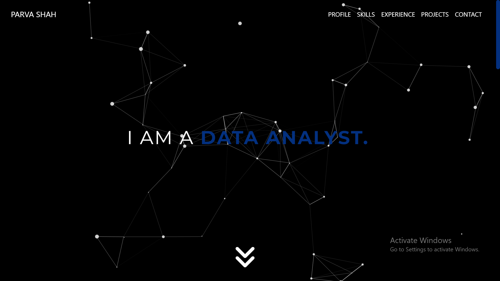
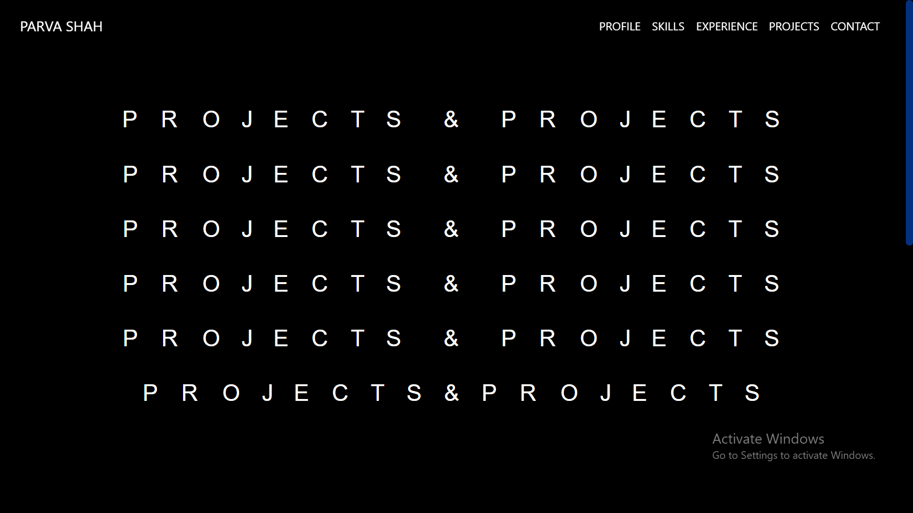
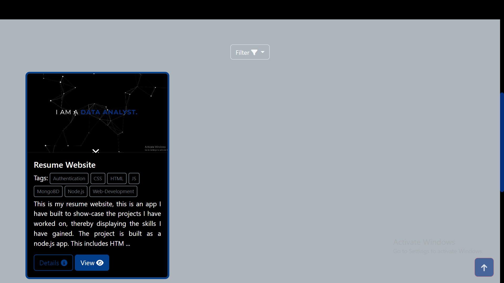
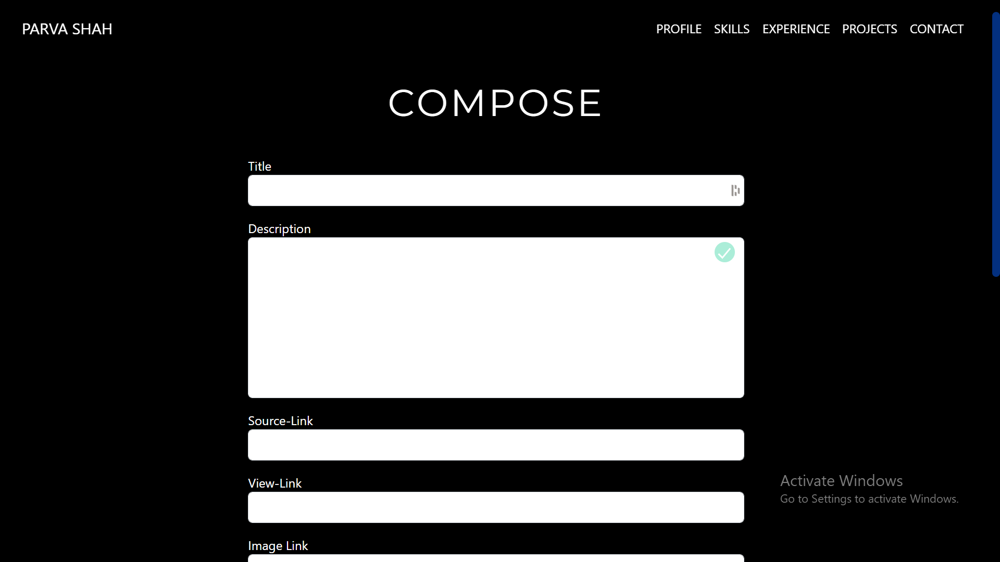
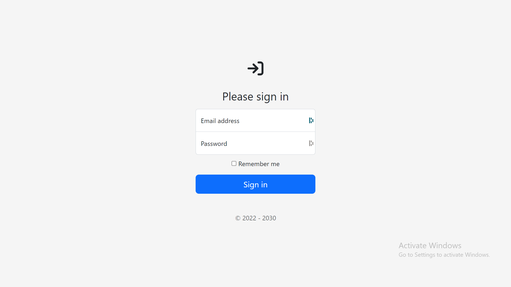

[![Contributors][contributors-shield]][contributors-url]
[![Forks][forks-shield]][forks-url]
[![Stargazers][stars-shield]][stars-url]
[![Issues][issues-shield]][issues-url]
[![MIT License][license-shield]][license-url]
[![LinkedIn][linkedin-shield]][linkedin-url]

<!-- PROJECT LOGO -->
 

  

<h3 align="center">Resume Website</h3>

  

    Resume Website to host projects.
     
    <a href="https://polite-crown-00833.herokuapp.com/">View Demo</a>
    ·
    <a href="https://github.com/parvashah-create/myPersonalSite/issues">Report Bug</a>
    ·
    <a href="https://github.com/parvashah-create/myPersonalSite/issues">Request Feature</a>
  

<!-- TABLE OF CONTENTS -->

  
Table of Contents

  <ol>
    <li>
      <a href="#about-the-project">About The Project</a>
      <ul>
        <li><a href="#built-with">Built With</a></li>
      </ul>
    </li>
    <li><a href="#getting-started">Getting Started</a></li>
    <li><a href="#Details">Details</a></li>
    <li><a href="#contributing">Contributing</a></li>
    <li><a href="#license">License</a></li>
    <li><a href="#contact">Contact</a></li>
  </ol>

<!-- ABOUT THE PROJECT -->
## About The Project
 

  

 
This a resume website I made to showcase the projects I have worked on thereby, displaying the skills I have gained.

(<a href="#top">back to top</a>)

### Built With

* [![Next][Next.js]][Next-url]
* [![React][React.js]][React-url]
* [![Bootstrap][Bootstrap.com]][Bootstrap-url]
* [![JQuery][JQuery.com]][JQuery-url]

(<a href="#top">back to top</a>)

<!-- GETTING STARTED -->
## Getting Started

This is the source code of the website I have hosted on heroku. If you would like to use this website or a part of the code for your use, please feel free to fork or just download it as zip directly.

<!-- ROADMAP -->
## Details 
The project is built as a node.js app. This includes HTML, CSS, JS, Bootstrap,Node.js  Jquery and other libraries. Details regarding dependencies can be found in package.json. Some features of the website include:
* Animated Landing Pages:
At the home landing, we can see beautiful responsive animation of particles moving and responding to the cursor. This was done using the particle.js library.
At the Projects landing, we have an animated "Projects & Projects" Letters which move in a mesmerizing way. This effect was achieved using the animate.js and letterize.js libraries.

  

  

 

* Projects Page:
The projects page consists of cards which are created by extracted data from the mongoDB server. The projects section also has filter button which filters through the project tags. The Projects are displayed in form of cards which consists the basic information about the project and two buttons which links to the project source and a demo.
 

  

* Projects Compose Page:
This page is secured through a authentication page which consists of login and password. Once authentication is completed sucessfully, it renders the projects compose page. This page is a form that uploads new data to the mongoDB server, this actions adds a new project on the projects page.
 

  

 

  

* Responsiveness:
The whole website is made completely responsive so it responds to all screen sizes perfectly. 

<!-- CONTRIBUTING -->
## Contributing

Contributions are what make the open source community such an amazing place to learn, inspire, and create. Any contributions you make are **greatly appreciated**.

If you have a suggestion that would make this better, please fork the repo and create a pull request. You can also simply open an issue with the tag "enhancement".
Don't forget to give the project a star! Thanks again!

1. Fork the Project
2. Create your Feature Branch (`git checkout -b feature/AmazingFeature`)
3. Commit your Changes (`git commit -m 'Add some AmazingFeature'`)
4. Push to the Branch (`git push origin feature/AmazingFeature`)
5. Open a Pull Request

(<a href="#top">back to top</a>)

<!-- LICENSE -->
## License

Distributed under the MIT License. See `LICENSE.txt` for more information.

(<a href="#top">back to top</a>)

<!-- CONTACT -->
## Contact

Parva J Shah - [Twitter](https://twitter.com/Parvashah_) - [Instagram](https://www.instagram.com/parva_shahh/) - [LinkedIn](https://www.linkedin.com/in/parva-j-shah-2394481a2/) - jmparvashah@gmail.com

Project Link: [https://github.com/parvashah-create/myPersonalSite](https://github.com/parvashah-create/myPersonalSite)

(<a href="#top">back to top</a>)

<!-- ACKNOWLEDGMENTS -->

<!-- MARKDOWN LINKS & IMAGES -->
<!-- https://www.markdownguide.org/basic-syntax/#reference-style-links -->
[contributors-shield]: https://img.shields.io/github/contributors/parvashah-create/myPersonalSite.svg?style=for-the-badge
[contributors-url]: https://github.com/parvashah-create/myPersonalSite/graphs/contributors
[forks-shield]: https://img.shields.io/github/forks/parvashah-create/myPersonalSite.svg?style=for-the-badge
[forks-url]: https://github.com/parvashah-create/myPersonalSite/network/members
[stars-shield]: https://img.shields.io/github/stars/parvashah-create/myPersonalSite.svg?style=for-the-badge
[stars-url]: https://github.com/parvashah-create/myPersonalSite/stargazers
[issues-shield]: https://img.shields.io/github/issues/parvashah-create/myPersonalSite.svg?style=for-the-badge
[issues-url]: https://github.com/parvashah-create/myPersonalSite/issues
[license-shield]: https://img.shields.io/github/license/parvashah-create/myPersonalSite.svg?style=for-the-badge
[license-url]: https://github.com/parvashah-create/myPersonalSite/blob/master/LICENSE.txt
[linkedin-shield]: https://img.shields.io/badge/-LinkedIn-black.svg?style=for-the-badge&logo=linkedin&colorB=555
[linkedin-url]: https://linkedin.com/in/Parvashah_
[product-screenshot]: images/screenshot.png
[Next.js]: https://img.shields.io/badge/next.js-000000?style=for-the-badge&logo=nextdotjs&logoColor=white
[Next-url]: https://nextjs.org/
[React.js]: https://img.shields.io/badge/React-20232A?style=for-the-badge&logo=react&logoColor=61DAFB
[React-url]: https://reactjs.org/
[Vue.js]: https://img.shields.io/badge/Vue.js-35495E?style=for-the-badge&logo=vuedotjs&logoColor=4FC08D
[Vue-url]: https://vuejs.org/
[Angular.io]: https://img.shields.io/badge/Angular-DD0031?style=for-the-badge&logo=angular&logoColor=white
[Angular-url]: https://angular.io/
[Svelte.dev]: https://img.shields.io/badge/Svelte-4A4A55?style=for-the-badge&logo=svelte&logoColor=FF3E00
[Svelte-url]: https://svelte.dev/
[Laravel.com]: https://img.shields.io/badge/Laravel-FF2D20?style=for-the-badge&logo=laravel&logoColor=white
[Laravel-url]: https://laravel.com
[Bootstrap.com]: https://img.shields.io/badge/Bootstrap-563D7C?style=for-the-badge&logo=bootstrap&logoColor=white
[Bootstrap-url]: https://getbootstrap.com
[JQuery.com]: https://img.shields.io/badge/jQuery-0769AD?style=for-the-badge&logo=jquery&logoColor=white
[JQuery-url]: https://jquery.com 
